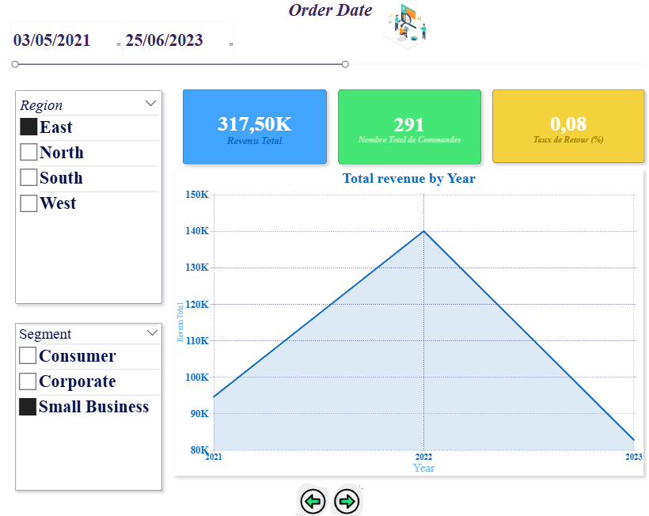
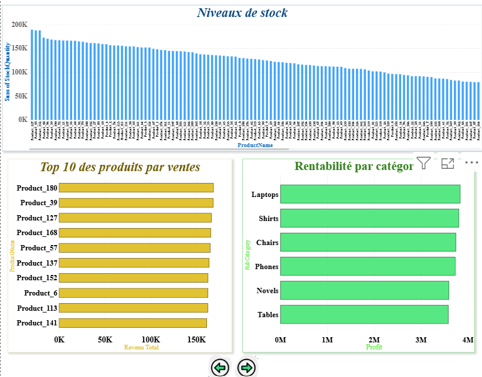
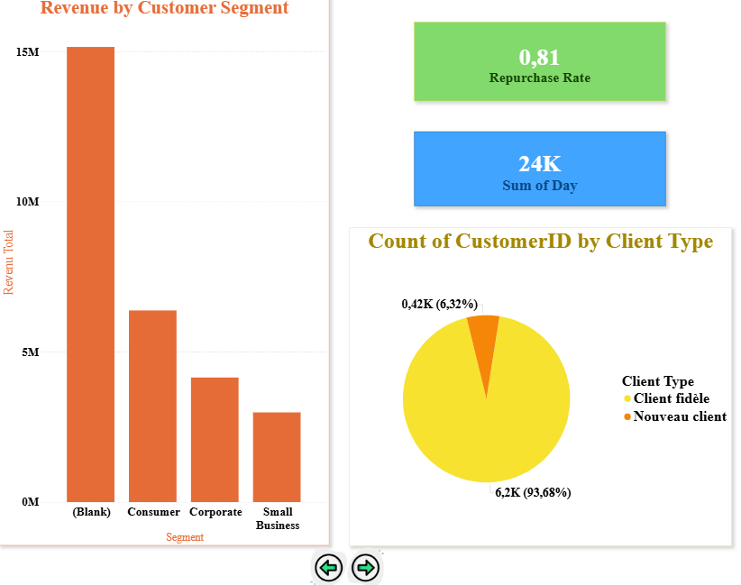
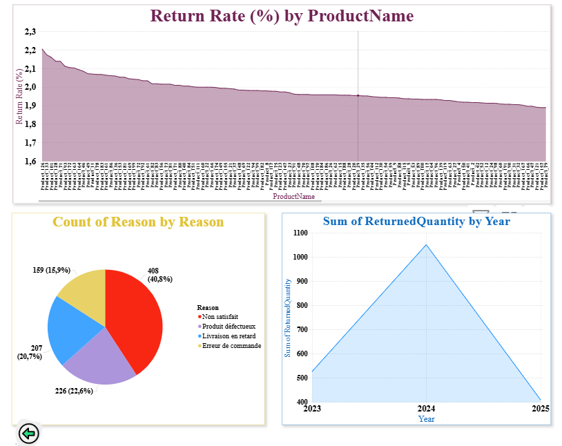

## 📊 Aperçu du Dashboard Power BI

Ce projet présente un tableau de bord Power BI dédié à l’analyse de données e-commerce.
Il permet de suivre les performances, les ventes, les stocks et les retours produits
à travers des indicateurs clairs et interactifs.

